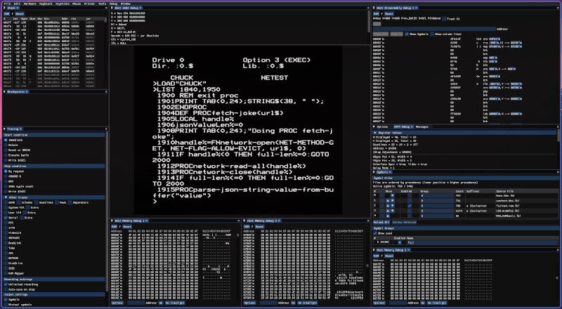
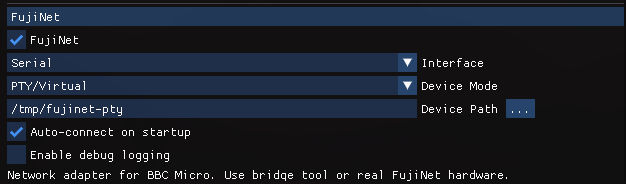
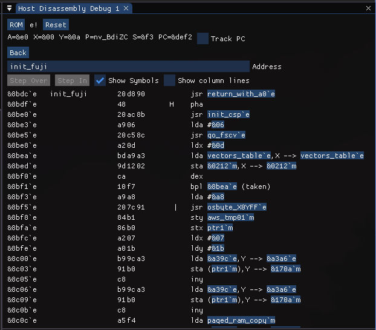

# Using the ROM with b2 emulator

I principly use [b2](https://github.com/tom-seddon/b2) for testing, and I've contributed many changes to improve it, including
MMFS and symbols support.

[My own fork](https://github.com/markjfisher/b2/tree/wip/mjf), which tracks upstream fairly regularly contains Serial support for b2.

Typically you build it with:
```
# You need to perform all the prerequisites mentioned in the Building.md doc of the b2 project, e.g. recursive submodule git pull
# but once done, this will build and install b2 and b2-debug into ~/.local/bin/

make install BUILD=RelWithDebInfo DEST=$HOME/.local
```

# Running b2

To run b2 in "debug" mode (which allows you to have SDL windows showing processor status etc), use something like:
```
b2-debug --config-folder=/path/to/config/folder/
```

This will create or read an existing configuration in this folder.

Arrange the window to your liking showing any memory dumps, the Disassembly window, etc



## Using FujiNet in B2

There are 2 distinct parts to FujiNet in b2. The "virtual serial connection" (i.e. RS423 connector), and a MOS FujiNet ROM

The "FujiNet" hardware configuration option emulates a Serial cable connection from the b2 to a FujiNet. It does not require the FujiNet ROM loaded into the emulator.

The ROM only provides the file system operations (e.g. FHOST, FMOUNT, FIN) so that  you can read/write disks via the FujiNet, but without the ROM, you can still run applications to the FujiNet as long as you configure the Serial Connection.

### Creating the Virtual Serial Connection

This is the equivalent of the RS423 input/output connector to the BBC, and allows serial comms from applications in b2 using standard serial port commands and applications.

In the Menu option "Hardware/Configs" create a new entry for your fujinet setup with b2.

At the end of the config, there is a section for enabling FujiNet:



Adjust the values as required. If you setup your POSIX fujinet-nio instance to have a symlink created on startup, then you can use that for the path to the fujinet device. I've only tested PTY from b2. There are options for connecting to a /dev/tty serial connection too, but YMMV.

The "FujiNet" device in b2 enables the Serial connection between the emulated BBC and the posix FujiNet-nio instance.

### Adding the "fn-rom" BBC ROM

Again, in the "Hardware/Configs" menu option, you can add your ROM to the emulated BBC to provide File System support.

Typically I have this created with:

- ROM F: BASIC II
- ROM E: /path/to/fn-rom/build/fujinet.rom

You do not need the fujinet.rom loaded to write applications that communicate with fujinet-nio. The ROM is for the File System side of things, e.g. *FHOST, *FMOUNT and getting disks loaded over the FujiNet.

The higher up the list (and larger the ROM number) the higher precedence the ROM has, so ROM E will ensure that file system operations are handled by FujiNet rom before others if you have them specified.

You will also need to enable the Virtual Serial Connection as described above when using the fn-rom MOS ROM.

# Symbol loading

Use the menu option Debug/Load Symbols/VICE...

This allows you to pick the Labels file output by (e.g.) cc65 if you have that in your build. Then any step debugging done in the emulator will also show and be able to use symbols from the application to make it easier to follow the code.



Multiple symbols files can be loaded, and arranged in priority order.
This is useful if you have ROM loaded, and are also debugging an compiled application from cc65 with its own symbols.

# Controlling B2 from scripts

There are extensive scripts for interacting with the b2 process via its own http interface.

See [b2-http.py](bin/b2-http.py) which has a help option to describe the various commands it can do.

Here's a breakdown of the more common ones.

## Copying the emulator's screen

The `start` and `wrap-adjustment` parameters are from the "CRTC Debug" information in b2, which is one of the debug windows you can add to the emulator.

Typically start will be 7c00, but if the screen has scrolled at all, then it will differ, as scrolling is achieved through manipulating the memory address being shown rather than copying bytes.

If you are in different modes, you will need to adjust the other parameters.

```
❯ ./bin/b2-http.py screen --start 7c00 --wrap-adjustment 5000 --screen-size 1024
```

This will output something like:
```text
BBC Computer 32K

Model B - FujiNet

BASIC

>
```

## Sending commands to the emulator

There are 2 modes for this, either pasting the contents of a file, or from the supplied text:
```
bin/b2-http.py paste --file b2-scripts/bwc.txt
bin/b2-http.py paste --text "CLS"
```

This can be useful for setting up common commands, e.g. FHOST/FIN/FMOUNT/*CAT.

## Writing to memory

Use the `poke` command to write to an address with the contents of a file.
This can be useful for fast loading binary files directly into memory for testing without having to load them via the file system.

Combined with `paste` you can load and execute a binary file very quickly:

```bash
bin/b2-http.py poke 1900 /path/to/some.bin && \
  bin/b2-http.py paste --text "CALL &1900"
```

This was particularly powerful for applications going into E00 with no filing system to load the file in the first place. Just directly write to memory and execute it.

## Reading from memory

`peek` allows you to fetch data from the running instance.
The 'end' address can be a length, decimal unless `0x` is part of the number:

```
❯ ./bin/b2-http.py peek -o /tmp/7c00.bin 7c00 +0x100

❯ hexdump -C /tmp/7c00.bin
00000000  20 20 20 20 20 20 20 20  20 20 20 20 20 20 20 20  |                |
*
00000020  20 20 20 20 20 20 20 20  42 42 43 20 43 6f 6d 70  |        BBC Comp|
00000030  75 74 65 72 20 33 32 4b  20 20 20 20 20 20 20 20  |uter 32K        |
00000040  20 20 20 20 20 20 20 20  20 20 20 20 20 20 20 20  |                |
*
00000070  20 20 20 20 20 20 20 20  4d 6f 64 65 6c 20 42 20  |        Model B |
00000080  2d 20 46 75 6a 69 4e 65  74 20 20 20 20 20 20 20  |- FujiNet       |
00000090  20 20 20 20 20 20 20 20  20 20 20 20 20 20 20 20  |                |
*
000000c0  20 20 20 20 20 20 20 20  42 41 53 49 43 20 20 20  |        BASIC   |
000000d0  20 20 20 20 20 20 20 20  20 20 20 20 20 20 20 20  |                |
*
00000100
```
